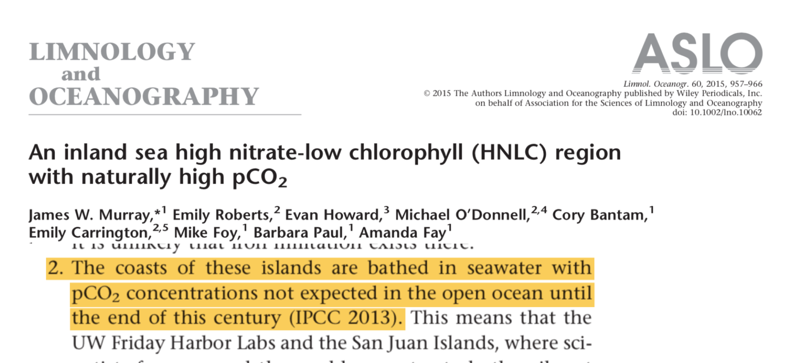

class:center,   nord-dark

background-image: linear-gradient(150deg,rgba(46, 52, 64, 90%),rgba(46, 52, 64, 90%),rgba(46, 52, 64, 50%),rgba(46, 52, 64, 40%)),  url("images/night1.jpg") 
background-position: center
background-size: cover


# eDNA in marine systems


 
### Investigating community ecology and global change with eDNA, metabarcoding and bioinformatics

.strong[**Ramón Gallego Simón**]


---
name:bio
class: nord-light
layout: true
```{r setup, include=FALSE}
knitr::opts_chunk$set(echo = F,
                      warning = FALSE,
                      message = FALSE)
library(tidyverse)
library(leaflet)
library(here)
```

##  .center[.under-line[Bio]]

---

.left-column[
.fancy[Ramón Gallego Simón]


```{r}
knitr::include_graphics("images/RGS_profile.jpg")
```

From the Canary Islands, Spain
]


.right-column[
```{r, echo = F}
leaflet() %>% 
  addTiles() %>% 
  setView(lat = 28.3, lng = -16.5, zoom = 5.5)
  
```
]


---

.left-column[
.fancy[Ramón Gallego Simón]

```{r, out.height='25%'}
knitr::include_graphics("images/foto_orla.png")
```

BSc and MSc in Madrid, Spain
]


.right-column[
```{r, echo = F}
leaflet() %>% 
  addTiles() %>% 
  setView(lat = 34, lng = -8, zoom =5)
  
```
]
---

.left-column[
.fancy[Ramón Gallego Simón]

```{r}

```
PhD in Auckland, Aotearoa New Zealand
]
.right-column[
```{r, echo = F}
leaflet() %>% 
  addTiles() %>% 
  setView(lat = -40, lng = +170, zoom =4)
  
```
]


???

All this to say, that coming from Spain to New Zealand... you are in for an interesting accent today

---

layout: false
name: Interests
background-image: url("images/facet.png")
background-position: center
background-size: contain


???


_But In all these movements, I have always had a focus on marine communities, and how to describe them, characterize their change and put it in context with the environment that they occur._


---
name: meroplankton photos
layout: true
class: nord-light, typo-selection
### .center[Meroplankton in the Southern Ocean]

---


.center[]

???

During my PhD I studied merplankton communities **transition** 

---
class: nord-dark
What is the species composition in the Ross Sea Coastal waters?

.left-column[
.center[

]]

.right-column[
.right[

]]

???

And I was interested in testing the idea of a decreasing planktonic diversity at higher latitudes, known as Thorson's rule

But a crucial step is a reliable identification of the species found **transition**

---
class: nord-dark
name: Next steps Bathylasma

#### Using Genetic IDs allowed us to link larvae, adults with the environment

.left-column[

  * Larvae 


  * Adults


]

.right-column[
.b-center[]
]

???

One of the most crucial points in my research path came with the idea that a meroplankton community not 
only tells us about the diversity similarity along a gradient, but also about the life history of the species present 

---
name: Bathylasma larvae and adult
class: nord-dark
#### Species distribution Models to predict loss and gains in habitat suitability
.pull-left[

]

.pull-right[


]
???

And we opened the door to applying distribution models to species detected using molecular tools,
and forecasting shifts in their distributions with climate change. To which we'll come back later  

---
<!-- name: Gradient of environmental change -->
layout: Classic
.south[Some text]

.Nord-dark-damp-img
---

layout: true
class: nord-light,  typo-selection
### .center[Species Detection]
---

name: Key species

.center[]

???

And directly linked to this idea of linking Certain key species with their communities and the environment is the ability to 

detect and identify sequences to the species they originated fromd

---
class: nord-dark
name: Pipelines

#### .center[BIOINFORMATICS for species ID]

.pull-left[
 * A demultiplexing and clustering pipeline
 
 
 

 * A locus-specific classification tree with curated reads 
]

--

.pull-right[
 * QC and decontamination steps
 
 
 

 
#### High confidence in presence and identity 
 
 
 
 ]
 
???

So I designed a bioinformatics pipeline to ensure we

---
layout: true
class: nord-light,  typo-selection
### .center[eDNA metabarcoding and quantification]


 

---


.center[]

???

We want to get the most information from our sequencing run 
But can we trust the number of reads assigned to each species as 
---

class: nord-dark, middle
name: PCR paper front


???

How to interpret the number of occurrences of a sequence in a sample?  

---
class: nord-dark


.pull-left[


## Differential Primer Affinity

]

--

.pull-right[ 
 
## Strong effect on DIVERSITY


]

---

class: nord-dark


.pull-left[


## Strong effect on between-sample dissimilarity
]


.pull-right[ 
 


]


---
layout: true
class: nord-light,  typo-selection
### .center[Ocean Acidification and warming]

---

name: And all those tools will become handy...

.center[]


---

class: nord-dark
name: How will forecasted conditions shape coastal communities

###.center[.fancy[.title[Environmental Conditions are changing at rapid pace]]]

.pull-left[
.center[]]

.pull-right[
 
]

---
class: nord-dark
###.center[.fancy[Afectting marine species ]

.pull-left[

]


.pull-right[
]
]


???
With global warming and increased pCO2 levels, there is little doubt that future marine communities will have to face a warmer, more acidic ocean
---
class: nord-dark
name: A lot of info on many spp

 

--


--


--


---
class: nord-dark
Name: Ecosystem-wide: not so much


.pull-left[

]

--

.pull-right[
.middle[
.fancy[
### Expanding to other ecosystems]]
]
---
name: WHy Hood Canal
class: middle, nord-dark
###.center[.fancy[.title[Why the Puget Sound?]]]

Naturally occuring High *p*CO<sub>2</sub>  levels offer a view of not far-fetched conditions



---
class: nord-dark
name: Research plan

###.center[.fancy[.title[Experimental design]]]

.pull-left[

```{r, echo = F, out.width= '90%'}

leaflet(data = read_csv(here("data","site.info.csv"))) %>% 
  addTiles() %>% 
  setView(lat = 47.5, lng = -122.5, zoom = 7) %>% 
  addMarkers(label = ~Site, 
             labelOptions = labelOptions(interactive = FALSE, clickable = NULL, noHide = NULL,
  permanent = FALSE, className = "", direction = "auto",
  offset = c(1, 1), opacity = 1, textsize = "20px",
  textOnly = FALSE, style = NULL, 
  sticky = TRUE)
  )
```
]

--

.pull-right[

.center[

]

]

---
name: Smpling design
class: nord-dark
###.center[.fancy[Sampling design]]

* Monthly sampling
    * Both eDNA and environmental sensing

* Biological replication

.right[]

* Technical replication

???

This sampling was carried out in a single day, which when working in a coastal sampling, brings in a major 
---
class: nord-dark, middle
name: But the tides?
###.center[.fancy[What about the tides?]]

* ### Sampling happens in one day and

* ### Seasonality of tide cycle 

--

###<div style="color:yellow">Does tide height and direction affect the community recovered?</div>
---

###.center[.fancy[What about the tides?]]

* ### It's applicable to many coastal projects


name: Continue with OA and marine comms


---

name: can we use sequence counts? The NAture of PCR


---

name: using both PA and eDNAindex


---

name: cluster analysis


---
name: binomial regression


---
name: Projections to 2095


---
name: back to the collage


---

