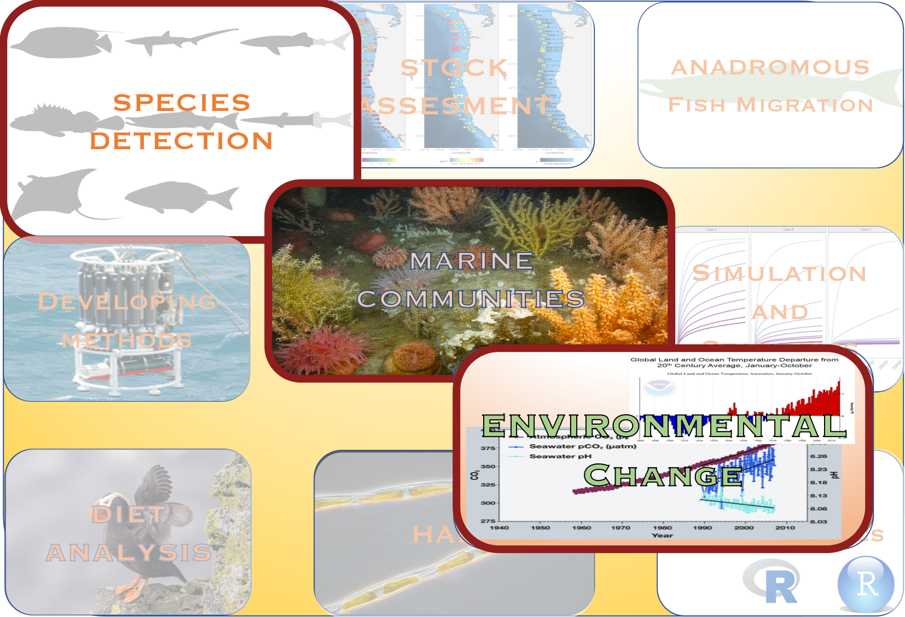
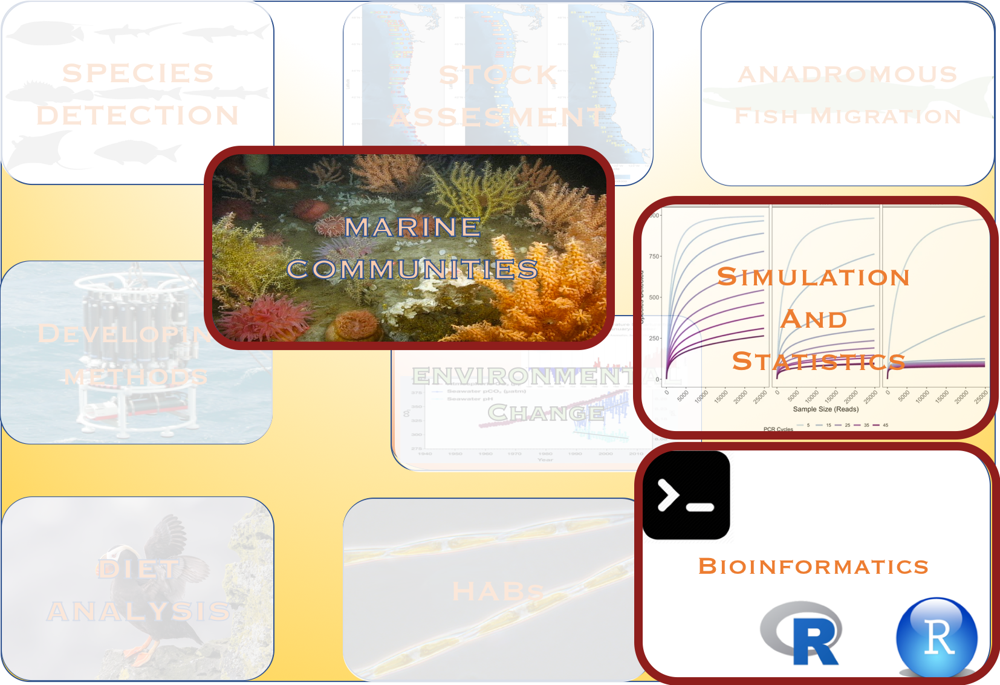
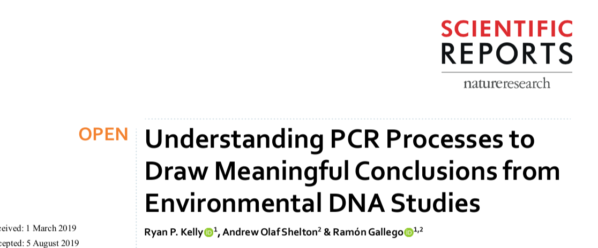

class:center,   nord-dark

background-image: linear-gradient(150deg,rgba(46, 52, 64, 90%),rgba(46, 52, 64, 90%),rgba(46, 52, 64, 50%),rgba(46, 52, 64, 40%)),  url("images/night1.jpg") 
background-position: center
background-size: cover


# eDNA in marine systems


 
### Investigating community ecology and global change with eDNA, metabarcoding and bioinformatics

.strong[**Ramón Gallego Simón**]


---
name:bio
class: nord-light
layout: true
```{r setup, include=FALSE}
knitr::opts_chunk$set(echo = F,
                      warning = FALSE,
                      message = FALSE)
library(tidyverse)
library(leaflet)
library(here)
```

```{css, echo=F}
.small { font-size: 70% }
```

##  .center[.under-line[Bio]]

---

.left-column[
.fancy[Ramón Gallego Simón]


```{r}
knitr::include_graphics("images/RGS_profile.jpg")
```

From the Canary Islands, Spain
]


.right-column[
```{r, echo = F}
leaflet() %>% 
  addTiles() %>% 
  setView(lat = 28.3, lng = -16.5, zoom = 5.5)
  
```
]


---

.left-column[
.fancy[Ramón Gallego Simón]

```{r, out.height='25%'}

```

BSc and MSc in Madrid, Spain
]


.right-column[
```{r, echo = F}
leaflet() %>% 
  addTiles() %>% 
  setView(lat = 34, lng = -8, zoom =5)
  
```
]
---

.left-column[
.fancy[Ramón Gallego Simón]

```{r}
knitr::include_graphics("images/doztor.jpg")
```
PhD in Auckland, Aotearoa New Zealand
]
.right-column[
```{r, echo = F}
leaflet() %>% 
  addTiles() %>% 
  setView(lat = -40, lng = +170, zoom =4)
  
```
]


???

All this to say, that coming from Spain to New Zealand... you are in for an interesting accent today

---

layout: false
name: Interests
background-image: url("images/facet.png")
background-position: center
background-size: contain


???
Theme slide to prepare people for this 

Firsts the core, then bring in the details

Picture for Future directions

_But In all these movements, I have always had a focus on marine communities, and how to describe them, characterize their change and put it in context with the environment that they occur._

---
eDNA a great tool

---
name: meroplankton photos
layout: true
class: nord-light, typo-selection
### .center[Meroplankton in the Southern Ocean]

---


.center[]

???

During my PhD I studied merplankton communities **transition** 

---
name: big q in my thesis

---
class: nord-dark
What is the species composition in the Ross Sea Coastal waters?

.left-column[
.center[

]]

.right-column[
.right[

]]

???

And I was interested in testing the idea of a decreasing planktonic diversity at higher latitudes, known as Thorson's rule

But a crucial step is a reliable identification of the species found **transition**

---
class: nord-dark
name: Next steps Bathylasma

#### Using Genetic IDs allowed us to link larvae, adults with the environment

.left-column[

  * Larvae 


  * Adults


]

.right-column[
.b-center[]
]

???

One of the most crucial points in my research path came with the idea that a meroplankton community not 
only tells us about the diversity similarity along a gradient, but also about the life history of the species present 

---
name: Bathylasma larvae and adult
class: nord-dark
#### Species distribution Models to predict loss and gains in habitat suitability
.pull-left[

]

.pull-right[


]
???

And we opened the door to applying distribution models to species detected using molecular tools,
and forecasting shifts in their distributions with climate change. To which we'll come back later  


---

layout: true
class: nord-light,  typo-selection
### .center[Species Detection]
???
Here I need to work in the transition
One species is cool - but multispecies
---

name: Key species

.center[]

???

And directly linked to this idea of linking Certain key species with their communities and the environment is the ability to 

detect and identify sequences to the species they originated fromd

---
class: nord-dark
name: Pipelines

#### .center[BIOINFORMATICS for species ID]

.pull-left[
 * A demultiplexing and clustering pipeline
 
 
 

 * A locus-specific classification tree with curated reads 
]

--

.pull-right[
 * QC and decontamination steps
 
 
 

 
#### High confidence in presence and identity 
 
 
 
 ]
 
???

So I designed a bioinformatics pipeline to ensure we

---
layout: true
class: nord-light,  typo-selection
### .center[eDNA metabarcoding and quantification]


 

---


.center[]

???

We want to get the most information from our sequencing run 
But can we trust the number of reads assigned to each species as 
---

class: nord-dark, middle, center
name: PCR paper front




???

How to interpret the number of occurrences of a sequence in a sample?  

---
class: nord-dark, typo, typo-selection


.pull-left[


## Differential Primer Affinity

]

--

.pull-right[ 
 
## Strong effect on <div style="color:yellow">DIVERSITY</div>


]

---

class: nord-dark


.pull-left[


## We can get quantitative information from metabarcoding

]


.pull-right[ 
 


]


---
layout: true
class: nord-light,  typo-selection
### .center[Ocean Acidification and warming]

---

name: And all those tools will become handy...

.center[]


???
So now that we have a set of tools for Quantification, species id and QC we can tackle ecological Qs with eDNA metabarcoding

---

class: nord-dark
name: How will forecasted conditions shape coastal communities

###.center[.fancy[.title[Environmental Conditions are changing at rapid pace]]]

.pull-left[
.center[]]

.pull-right[
 
]

---
class: nord-dark
###.center[.fancy[Affectting marine species ]

.pull-left[

]


.pull-right[
]
]


???
With global warming and increased pCO2 levels, there is little doubt that future marine communities will have to face a warmer, more acidic ocean
---
class: nord-dark
name: A lot of info on many spp

 

--


--


--


---
class: nord-dark
Name: Ecosystem-wide: not so much


.pull-left[

]

--

.pull-right[
.middle[
.fancy[
### Expanding to other ecosystems]]
]
---
name: WHy Hood Canal
class: middle, nord-dark
###.center[.fancy[.title[Why the Puget Sound?]]]

Naturally occuring High *p*CO<sub>2</sub>  levels offer a view of not far-fetched conditions


---
class: nord-dark
name: Research plan

###.center[.fancy[.title[Experimental design]]]

.pull-left[

```{r, echo = F, out.width= '90%'}

leaflet(data = read_csv(here("data","site.info.csv"))) %>% 
  addTiles() %>% 
  setView(lat = 47.5, lng = -122.5, zoom = 7) %>% 
  addMarkers(label = ~Site, 
             labelOptions = labelOptions(interactive = FALSE, clickable = NULL, noHide = NULL,
  permanent = FALSE, className = "", direction = "auto",
  offset = c(1, 1), opacity = 1, textsize = "20px",
  textOnly = FALSE, style = NULL, 
  sticky = TRUE)
  )
```
]

--

.pull-right[

.center[

]

]

---
name: Smpling design
class: nord-dark
###.center[.fancy[Sampling design]]

* Monthly sampling
    * Both eDNA and environmental sensing

* Biological replication

.right[]

* Technical replication

???

This sampling was carried out in a single day, which when working in a coastal sampling, brings in a major 
---
class: nord-dark, middle
name: But the tides?
###.center[.fancy[What about the tides?]]

* ### Sampling happens in one day and

* ### Seasonality of tide cycle 

--

###<div style="color:yellow">Does tide height and direction determine the community recovered?</div>
---
name: Continue with OA and marine comms
layout: false
###.center[Ocean Acidification and warming<br>.fancy[What about the tides?]]


.pull-left[
*  It's applicable to many coastal projects


*  Even at small spatial scales

]

.pull-right[
* It's a small source of variation

* And communities showed in the same locality regardless<sup>*</sup> of the tide


.right[.footnote[ .small[[*] Except when they don't]]]
]

---
layout:
name: Do we have what we need

* A sampling design that covers the spectrum of the variables to study

* NO TIDES PROBLEM

* Statistical tools to analyze the data


---
name: Shiny app
class: nord-dark
### Question 1: Can we see the spatio temporal patterns of certain spp

### We can visualize the fluctuations


---
class: nord-dark
name: using both PA and eDNAindex
### Question 2: Do we see different Communities associated with<br> Temperature and pH


---
layout: true
name: 
class: nord-dark
### Question 3: How do species fare in the future Puget Sound

---
name: binomial regression

.fancy[Modelling the presence of each taxa:]

* We fit a binomial regression (presence/absence)

* independent fits for <div style="color:yellow">regions and seasons</div> 

* as a function of Temperature and pH

---

name: Projections to 2095

### .center[<div style="color:nord-14">Future conditions in Puget Sound under RCP8.5</div>]

.left-column[

### * Target values from Khangaonkar et al, 2019

### * Future scenario shows some extreme values

]

.right-column[
]

???

Taking advantage from recently published models for the inner sea
---


### .center[.fancy[Sampling from the posterior probabilities:]]

.pull-left[
#### * Each taxa's response


]

.pull-right[

#### * Diversity estimates

]

---
name: back to the collage
layout: true
class: nord-dark, middle
## .center[Future directions]
---

### .center[.fancy[Ocean acidification and marine communities]]

.pull-left[

Goals:
* Extrapolate to a different temperate ecosystem

* Model food web interactions from metabarcoding data

* Project food webs into predicted conditions

* Benthic taxa - Expand dataset to include more localities
]
.pull-right[
Tentative funding:
* Sea Grant
* States' DNR
* Non-profit
* Aquaculture stakeholders

]

---

### .center[.fancy[Harmful Algal Blooms]]

.pull-left[

Goals:

* Network of early detection

* Metabarcoding and Multivariate predictors

* Citizen's engagement


]
.pull-right[

Tentative funding:
* Sea Grant
* States' DNR
* Non-profit
* Aquaculture stakeholders

]
---

### .center[.fancy[Species Shifts with Climate Change]]
.pull-left[

Goals:

* Automate data gathering and processing

* Establish collaborations across states

* Project marine invaders risk assesment

* Seascape genetics for benthic-planktonic
]
.pull-right[

Tentative funding:
* NSF
* States' DNR - Marine invasions


]

---

### .center[.fancy[Fisheries: stock assessment]]

.pull-left[

Goals:

* Collect eDNA data alongside current methods

* Establish collaborations with NEFSC

* eDNA qPCR assays and metabarcoding communities


]
.pull-right[

Tentative funding:
* NOAA
* Fishing companies 


]
