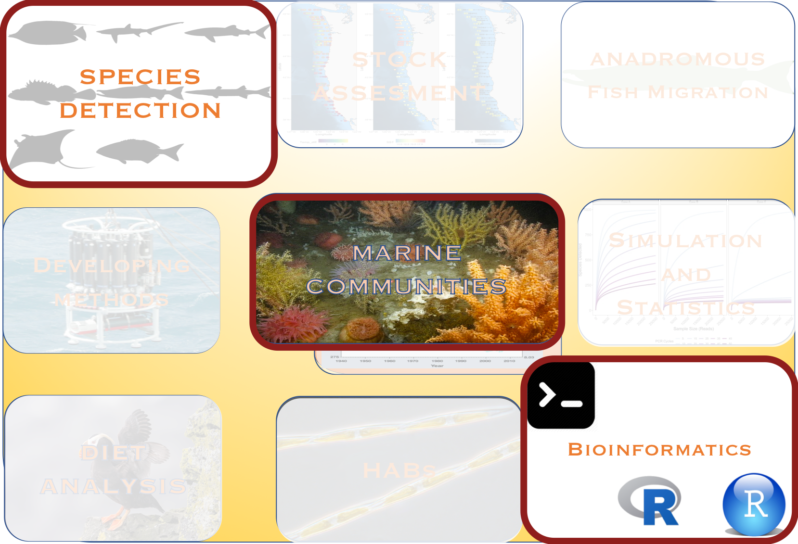
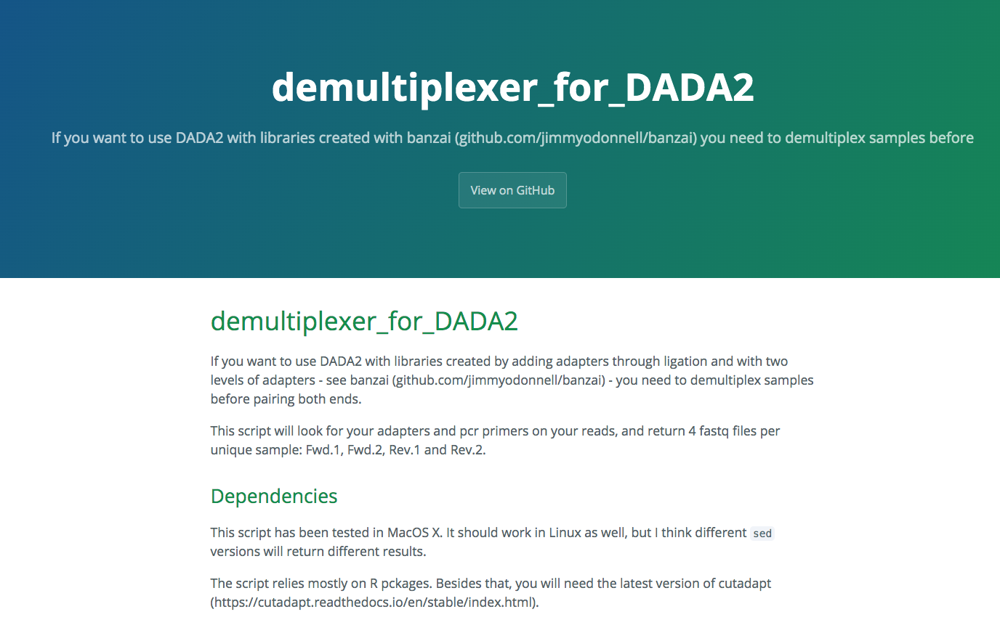
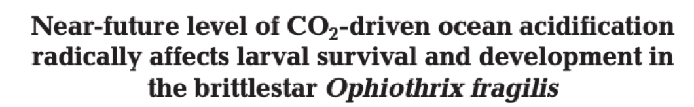

class:center,   nord-dark

background-image: linear-gradient(150deg,rgba(46, 52, 64, 90%),rgba(46, 52, 64, 90%),rgba(46, 52, 64, 50%),rgba(46, 52, 64, 40%)),  url("images/night1.jpg") 
background-position: center
background-size: cover

```{css, echo=F}
.small { font-size: 70% }
.huge  { font-size: 120% }
```


# eDNA in marine systems


 
### Investigating community ecology and global change with eDNA, metabarcoding and bioinformatics
</br>
</br>
</br>
.huge[**Ramón Gallego Simón**]


---
name:bio
class: nord-dark
layout: true

```{r setup, include=FALSE}
knitr::opts_chunk$set(echo = F,
                      warning = FALSE,
                      message = FALSE)
library(tidyverse)
library(leaflet)
library(here)
library (kableExtra)
```


##  .center[Bio]

---
class: middle, nord-dark
background-image: linear-gradient(150deg,rgba(46, 52, 64, 60%),rgba(46, 52, 64, 60%),rgba(46, 52, 64, 60%),rgba(46, 52, 64, 20%)),  url("images/Teide.jpg") 
background-position: center
background-size: cover

.leftmost-column[
.fancy[Ramón Gallego Simón]


```{r}
knitr::include_graphics("images/RGS_profile.jpg")
```

From the Canary Islands, Spain
]


.center-column[
```{r, echo = F}
leaflet() %>%
  addTiles() %>%
  setView(lat = 28.3, lng = -16.5, zoom = 5.5)

```
]

.rightmost-column[
.middle[
```{r, echo = F}
knitr::include_graphics("images/Canary_Islands.jpg")
```

]

]

---
layout: false
class: middle, nord-dark
background-image: linear-gradient(150deg,rgba(46, 52, 64, 60%),rgba(46, 52, 64, 60%),rgba(46, 52, 64, 60%),rgba(46, 52, 64, 20%)),  url("images/Madridmequema.jpg") 
background-position: center
background-size: cover


## .center[Ramón Gallego Simón]

.leftmost-column[


```{r, out.height='25%'}
knitr::include_graphics("images/foto_orla.png")
```

BSc and MSc in Madrid, Spain

```{r, out.height='25%'}
knitr::include_graphics("images/UAM.white.png")
#TODO: Text box
```


]


.center-column[
```{r, echo = F}
leaflet() %>% 
  addTiles() %>% 
  setView(lat = 34, lng = -8, zoom =5)
  
```
]

.rightmost-column[
```{r, out.height='25%'}
knitr::include_graphics("images/Cabo_De_Gata.jpg")
```

]
---
layout: false
class: middle, nord-dark
background-image: linear-gradient(150deg,rgba(46, 52, 64, 60%),rgba(46, 52, 64, 60%),rgba(46, 52, 64, 60%),rgba(46, 52, 64, 20%)),  url("images/Fern.jpg") 
background-position: center
background-size: cover

## .center[Ramón Gallego Simón]

.leftmost-column[


```{r}
knitr::include_graphics("images/doztor.jpg")
```
PhD in Auckland, Aotearoa New Zealand


```{r, out.height='25%',out.extra='style="background-color: #9ecff7; padding:5px; display: inline-block;.Nord-dark-damp-img"'}
knitr::include_graphics("images/uoa-logo-2015-reverse.png")
knitr::include_graphics("images/NIWA_Logo2018.png")
#TODO: Text box
```


]

.center-column[

```{r, echo = F}
leaflet() %>% 
  addTiles() %>% 
  setView(lat = -40, lng = +170, zoom =4)
  
```
]

.rightmost-column[
```{r, out.height='25%'}
knitr::include_graphics("images/Auckland.jpg")

```

]


???

All this to say, that coming from Spain to New Zealand... you are in for an interesting accent today

---

class: middle, nord-dark
background-image: linear-gradient(150deg,rgba(46, 52, 64, 60%),rgba(46, 52, 64, 60%),rgba(46, 52, 64, 60%),rgba(46, 52, 64, 20%)),  url("images/Seattle.jpg") 
background-position: center
background-size: cover

## .center[Ramón Gallego Simón]

.leftmost-column[


```{r}
knitr::include_graphics("images/PNW.jpg")
```
To a Postdoc in Seattle, WA

```{r, out.extra='style="background-color: #9ecff7; padding:5px; display: inline-block;"'}

knitr::include_graphics("images/UW_trans.png")
```
]
.center-column[
```{r, echo = F}
leaflet() %>% 
  addTiles() %>% 
  setView(lat = 47, lng = -122, zoom = 7)
  
```
]

.rightmost-column[

```{r}
knitr::include_graphics("images/2017-05-08-ARL-1470.JPG")
```

And another postdoc 
```{r}
knitr::include_graphics("images/NOAA-fisheries-logo.jpg")
```

]
---

layout: false
name: Interests
background-image: url("images/CORE.png")
background-position: center
background-size: cover


???
Theme slide to prepare people for this 

Firsts the core, then bring in the details

Picture for Future directions

_But In all these movements, I have always had a focus on marine communities, and how to describe them, characterize their change and put it in context with the environment that they occur._

---
layout: false
name: Skills
background-image: url("images/Skills.png")
background-position: center
background-size: contain


???

AND THAT TAKES developing some _Skills_


---

layout: false
name: Interests
background-image: url("images/facet.png")
background-position: center
background-size: contain


???

Which have allowed me to tackle other questions. And that's one of the things that are great ab eDNA.. 


---
name: meroplankton photos
layout: true
class: nord-light, typo-selection
### .center[Meroplankton in the Southern Ocean]

---


.center[]

???

During my PhD I studied merplankton communities **transition** 

---
class: nord-dark
layout: true
name: Meroplankton
background-image: linear-gradient(150deg,rgba(46, 52, 64, 60%),rgba(46, 52, 64, 60%),rgba(46, 52, 64, 60%),rgba(46, 52, 64, 20%)),url("images/fondo.antartida.JPG")
background-position: center
background-size: cover

---

## What is the larval diversity in the Coastal Ross Sea?

</br>
.pull-left[

]

.pull-right[

.pull-left[]

.pull-right[]

</br>

.center[]

]
---
class: middle

.left-column[
* ### Many types - how many species?
</br>

</br>

]


.right-column[


]

.footnote.oc-bg-black.opacity-10.nord-dark[
**Gallego, R.**, Heimeier, D., Lavery, S., Sewell, M.A. 2015. The meroplankton communities from the
coastal Ross Sea: a latitudinal study. Hydrobiologia, 761 (1): 195-209]

???

And I was interested in testing the idea of a decreasing planktonic diversity at higher latitudes, known as Thorson's rule

But a crucial step is a reliable identification of the species found **transition**

---
class: nord-dark
name: Next steps Bathylasma

## .center[ Two life stages: how does environmental change affects them?]

.left-column[

  * Larvae 


  * Adults


]

.right-column[
.center[]
<!--  -->
]


???

One of the most crucial points in my research path came with the idea that a meroplankton community not 
only tells us about the diversity similarity along a gradient, but also about the life history of the species present 

---
name: Bathylasma larvae and adult
class: nord-dark
### Habitat Suitability changes differently for 
.pull-left[
### Adults

]

.pull-right[
### Larvae

]

.footnote.oc-bg-black.opacity-10.nord-dark[
**Gallego, R.**, Basher, Z., Lavery, S., Dennis, T.E., Sewell, M.A. 2017. On the need to consider multiphasic sensitivity of marine organisms to climate change: a case study of the Antarctic acorn barnacle.
Journal of Biogeography, 44: 2165-2175]

???

And we opened the door to applying distribution models to species detected using molecular tools,
and forecasting shifts in their distributions with climate change. To which we'll come back later  
---

name: Bathylasma larvae and adult
class: nord-dark
### Habitat Suitability changes differently for 
.pull-left[
### Adults

]

.pull-right[
### Larvae

]
.footnote.oc-bg-black.opacity-10.nord-dark[
**Gallego, R.**, Basher, Z., Lavery, S., Dennis, T.E., Sewell, M.A. 2017. On the need to consider multiphasic sensitivity of marine organisms to climate change: a case study of the Antarctic acorn barnacle.
Journal of Biogeography, 44: 2165-2175]
---
name:Onesp-multisp-eDNA
class: nord-dark, typo-selection

background-image:url("images/eDNA_concept.png")


---

class: nord-dark

background-image: linear-gradient(150deg, rgba(255, 255, 255, 100%), rgba(255, 255, 255, 50%), rgba(255, 255, 255, 20%)),url(images/eDNA_concept.png)
background-size: cover
## .center.nord11[Species Detection]


.center[]


???

And directly linked to this idea of linking Certain key species with their communities and the environment is the ability to 

detect and identify sequences to the species they originated fromd

---
class: nord-light,  typo-selection
name: bkg1
background-image: linear-gradient(150deg, rgba(255, 255, 255, 100%), rgba(255, 255, 255, 50%), rgba(255, 255, 255, 20%)),url(images/eDNA_concept.png)
background-size: cover
layout: true
---

## .center.nord11[Species Detection]

.center[]

---
class: nord-light
name: Pipelines
layout: false
background-image: linear-gradient(150deg, rgba(255, 255, 255, 100%), rgba(255, 255, 255, 50%), rgba(255, 255, 255, 20%)),url(images/eDNA_concept.png)
background-size: cover
</br> 
## .center.nord9[BIOINFORMATICS for species ID]
</br> 
.pull-left.oc-bg-black.opacity-40.nord-light[

* ####  A demultiplexing and clustering pipeline

.center[]

.center[[github.com/ramongallego](https://github.com/ramongallego?tab=repositories) 
]
 
 * A locus-specific classification tree with curated sequences 
 


]


.pull-right.oc-bg-black.opacity-10.nord-light[
 * QC and decontamination steps
 
 

 .center[]
 
 

 
* High confidence in presence and identity 
 
 
 
 ]
 
???

So I designed a bioinformatics pipeline to ensure we

---
name: Solvingnumbers


## Now we have an abundance table
</br>

```{r dataTABLE, echo = F, warning=FALSE ,message=FALSE, out.height='70%', out.width='70%'}
convert.names<- function(x){paste0("Sample", 1:length(x))}
read_csv(here("data", "ASV_table_all_together.csv")) %>%  
  left_join(read_csv(here("data", "Annotated.hashes.csv"))) %>% 
  unite(family, genus, species, sep = "|", col = "taxa") %>% 
  filter(taxa !="NA|NA|NA") %>% 
 
  group_by(taxa) %>% tally %>% arrange(desc(n)) %>% slice(1:10) %>% 
  pull(taxa) -> keepers 
  read_csv(here("data", "ASV_table_all_together.csv")) %>%  
  left_join(read_csv(here("data", "Annotated.hashes.csv"))) %>% 
   unite(family, genus, species, sep = "|", col = "taxa", remove = F) %>%
    mutate(label = case_when(is.na(species) ~  paste0(genus, " sp."),
                                                   TRUE            ~ species)) %>% 
  
    filter(Miseq_run ==1,  taxa %in% keepers) %>% 
    mutate(sample = fct_relabel(sample, convert.names)) %>% 
    arrange(sample) %>% 
    pivot_wider(id_cols = label, names_from = sample, values_from = nReads, values_fill = list (nReads = 0), values_fn = list(nReads= sum)) %>% 
    rename (Taxa = label) %>%
    select(1:7) %>% 
    kable() %>% 
    kable_styling(full_width = T) %>% 
       column_spec(1, italic  = T) %>% 
       column_spec(2:6, width = '1in') -> nice.table
   

nice.table
```

---
## What does this tell us about the world?
</br>

```{r, echo = F, warning=FALSE ,message=FALSE, out.height='70%', out.width='70%'}
nice.table %>% 
  column_spec(2, width = '1in', background = "yellow") %>% 
  row_spec(1,background = "yellow") 
```

---
class: nord-dark,  typo-selection
background-image: linear-gradient(150deg, rgba(0, 0, 0, 100%), rgba(0, 0, 0, 50%), rgba(0, 0, 0, 20%)),url(images/eDNA_concept.png)
background-size: cover
layout: true
### .center[eDNA metabarcoding and quantification]

---


 


.center[]

???

We want to get the most information from our sequencing run 
But can we trust the number of reads assigned to each species as 
---

class: nord-dark, middle, center
name: PCR paper front


???

How to interpret the number of occurrences of a sequence in a sample?  

---
class: nord-dark, typo, typo-selection


.pull-left[


## Differential Primer Affinity

]

--

.pull-right[ 
 
## Strong effect on <div style="color:yellow">DIVERSITY</div>

]

.center[
]


---

class: nord-dark


.left-column[
</br>


]


.right-column[ 
 
.center[## We can get quantitative information from metabarcoding]

]

.center[
]

.footnote.oc-bg-black.opacity-10.nord-dark[
Kelly, R.P., Shelton, A., **Gallego, R**. 2019. Understanding PCR Processes to Draw Meaningful Conclusions from Environmental DNA Studies. Scientific Reports, 9(1):1-14.]
---
name:OA_cover
layout: true
class: nord-dark,  typo-selection
background-image: linear-gradient(150deg, rgba(0, 0, 0, 100%), rgba(0, 0, 0, 50%), rgba(0, 0, 0, 20%)),url(images/OA_fondo.jpg)
background-size: cover
### .center[Ocean Acidification and warming]

---

name: And all those tools will become handy...

.center[]


???
So now that we have a set of tools for Quantification, species id and QC we can tackle ecological Qs with eDNA metabarcoding

---

class: nord-dark
name: How will forecasted conditions shape coastal communities


.pull-left[
</br>
.center[]]

.pull-right[
</br>
 
]

---
class: nord-dark
###.center[.fancy[Affectting marine species ]

.pull-left[

]


.pull-right[
]
]


???
With global warming and increased pCO2 levels, there is little doubt that future marine communities will have to face a warmer, more acidic ocean
---
class: nord-dark
name: A lot of info on many spp

 

--


--


--


---
class: nord-dark
Name: Ecosystem-wide: not so much


.pull-left[

]

--

.pull-right[
.middle[
.fancy[
### Expanding to other ecosystems]]
]
---
name: WHy Hood Canal
class: middle, nord-dark
###.center[.fancy[.title[Why the Puget Sound?]]]

Naturally occuring High *p*CO<sub>2</sub>  levels offer a view of not far-fetched conditions


---
class: nord-dark
name: Research plan

###.center[.fancy[.title[Experimental design]]]

.pull-left[

```{r, echo = F, out.width= '90%'}

leaflet(data = read_csv(here("data","site.info.csv"))) %>% 
  addTiles() %>% 
  setView(lat = 47.5, lng = -122.5, zoom = 7) %>% 
  addMarkers(label = ~Site, 
             labelOptions = labelOptions(interactive = FALSE, clickable = NULL, noHide = NULL,
  permanent = FALSE, className = "", direction = "auto",
  offset = c(1, 1), opacity = 1, textsize = "20px",
  textOnly = FALSE, style = NULL, 
  sticky = TRUE)
  )
```
]

--

.pull-right[

.center[

]

]

---
name: Smpling design
class: nord-dark
###.center[.fancy[Sampling design]]

.left-column[
* Monthly sampling
    * Both eDNA and environmental sensing
</br>
* Biological replication
</br>
* Technical replication
]
.right-column.center[
]

.footnote.oc-bg-black.opacity-10.center.nord-dark[**Gallego, R.**, Jacobs-Palmer, E., Cribari, K., Kelly, R.P. Environmental DNA Metabarcoding Reveals Win- ners and Losers of Global Change in Coastal Waters. Under resubmission at Proceedings B.]

???

This sampling was carried out in a single day, which when working in a coastal sampling, brings in a major 
---
class: nord-dark, middle
name: But the tides?
###.center[.fancy[What about the tides?]]

* ### Sampling happens in one day and

* ### Seasonality of tide cycle 

--

###<div style="color:yellow">Does tide height and direction determine the community recovered?</div>
---
layout: false
class: nord-dark,  typo-selection
background-image: linear-gradient(150deg, rgba(0,0,0, 100%), rgba(0,0,0, 70%), rgba(0,0,0, 50%)),url(images/low-tide1.jpg)
background-size: cover
name: Tides1


###.center[What about the tides?]
---
template: Tides1


.left-column.huge[
* Even at small spatial scales]

.right-column.center[

]
---
template: Tides1

.left-column.huge[
* It's a small source of variation]

.right-column.center[

]

---
template: Tides1

.left-column.huge[
* And communities showed in the same locality regardless<sup>*</sup> of the tide]

.right-column.center[

]


.footnote.oc-bg-black.opacity-10.center.nord-dark[Kelly, R. P., **Gallego, R.**, Jacobs-Palmer, E. 2018. The effect of tides on nearshore environmental DNA.
PeerJ, 6:e4521.]

---
template:OA_cover
name: Do we have what we need
layout: true

---

### Have we covered our bases? (This is baseball talk, right?)

* ### A sampling design that covers the spectrum of the variables to study

* ###   We account for the influence of tides

* ### Bioinformatics tools to clean the data


---
name: Shiny app
class: nord-dark

## .center[Question 1: Can we see the spatio temporal patterns of the species found]

</br>

### We can visualize the fluctuations


---
class: nord-dark
name: using both PA and eDNAindex
### .center[Question 2: Do we see different Communities associated with<br> Temperature and pH]
</br>


---

name: 
class: nord-dark
### Question 3: How do species fare in the future Puget Sound


##.fancy[Modelling the presence of each taxa:]

* We fit a logistical regression (presence/absence)


* independent fits for <div style="color:yellow">regions and seasons</div> 

* With Temperature and pH as fixed effects

---

name: Projections to 2095

### .center[Future conditions in Puget Sound under RCP8.5]

.left-column[

*  .huge[Target values from Khangaonkar et al, 2019]

*  .huge[Future scenario shows some extreme values]

* .huge[Most of the conditions are already present in today's scenario]

]

.right-column[
]

???

Taking advantage from recently published models for the inner sea
---


### .center[.fancy[Sampling from the posterior probabilities:]]


* ####  Each taxa's response


---

### .center[.fancy[Sampling from the posterior probabilities:]]

* ####  Diversity estimates


---

##.left.nord13[In Summary:]

* We need model systems that naturally experience Temperature and pH fluctuations
--
* eDNA metabarcoding is a really powerfull tool to sample:
    
    * across major taxa
    * studying 100s of species at a time
--
* Careful consideration of:
    
    * field,
    * laboratory,
    * bioinformatics processes
--
* It pays off with:

    * community-wide,
    * single species projections


---
name: back to the collage
layout: true
class: nord-dark, middle
background-image: linear-gradient(150deg, rgba(0,0,0, 100%), rgba(0,0,0, 70%), rgba(0,0,0, 50%)),url(images/AcadiaNP.jpg)
background-size: cover
## .center[Future directions]
---

### .center[.fancy[Ocean acidification and warming: impact on marine communities]]

---

#### .center[.fancy[Ocean acidification and warming: impact on marine communities]]

</br>
.pull-left.oc-bg-black.opacity-40.nord-dark[

Goals:

* Extrapolate to a different cold-temperate ecosystem

* Model food web interactions from metabarcoding data

* Project food webs into predicted conditions

* Benthic taxa - Expand dataset to include more localities

]

.pull-right.oc-bg-black.opacity-40.nord-dark[

Potential partners:
* Sea Grant
* NOAA's Ocean Acidification Program
* States' DNR
* Non-profit
* Aquaculture stakeholders

]

---

### .center[.fancy[Harmful Algal Blooms]]

---

### .center[.fancy[Harmful Algal Blooms]]
</br>

.pull-left.oc-bg-black.opacity-40.nord-dark[

Goals:

* Network of early detection

* Metabarcoding and Multivariate predictors

* Citizen's engagement


]
.pull-right.oc-bg-black.opacity-40.nord-dark[

Potential partners:
* Sea Grant
* States' DNR
* Non-profit
* Aquaculture stakeholders
* High Schools

]
---

### .center[.fancy[Species Shifts with Climate Change]]

---
class: center

#### .center[.fancy[Species Shifts with Climate Change]]


.leftmost-column.oc-bg-black.opacity-40.nord-dark[

Goals:

* Automate data gathering and processing

* Establish collaborations across states

* Project marine invaders risk assesment

* Seascape genetics for benthic-planktonic
]

.center-column[
.center[


```{r, out.width="85%", out.extra='style="background-color: #9ecff7; padding:5px; display: inline-block;.Nord-dark-damp-img"'}


```
]


]

.rightmost-column.oc-bg-black.opacity-40.nord-dark[

Potential partners:
* NSF
* State of Maine DMR - Marine invasions
* Citizen scientists

]

---

### .center[.fancy[Fisheries: stock assessment]]

---
class: center
#### .center[.fancy[Fisheries: stock assessment]]

.leftmost-column.oc-bg-black.opacity-40.nord-dark[

Goals:

* Collect eDNA data alongside current methods

* Establish collaborations with NEFSC

* eDNA qPCR assays and metabarcoding communities


]

.center-column[
.center[


```{r, out.width="100%", out.extra='style="background-color: #9ecff7; padding:5px; display: inline-block;.Nord-dark-damp-img"'}


```
]

]


.rightmost-column.oc-bg-black.opacity-40.nord-dark[

Potential partners:
* NOAA
* Fishing companies 
  ]

---


### .center[.fancy[Biodiversity surveys]]

---
class: center
#### .center[.fancy[Biodiversity surveys]]

.leftmost-column.oc-bg-black.opacity-40.nord-dark[

Goals:

* Leverage from in house & collaborators eDNA surveys

* Design & test in silico & laboratory assays


]

.center-column[
.center[


```{r, out.width="100%", out.extra='style="background-color: #9ecff7; padding:5px; display: inline-block;.Nord-dark-damp-img"'}


```
]

]


.rightmost-column.oc-bg-black.opacity-40.nord-dark[

Potential partners:
* NOAA
* Fishing companies
* WHOI
  ]

---


### .center[.fancy[Biodiversity statistics]]

---
class: center
#### .center[.fancy[Biodiversity statistics]]

.leftmost-column.oc-bg-black.opacity-40.nord-dark[

Goals:

* Crunching numbers

* A set of guidelines for biodiversity statistics with eDNA / metabarcoding 


]

.center-column[
.center[


```{r, out.width="100%", out.extra='style="background-color: #9ecff7; padding:5px; display: inline-block;.Nord-dark-damp-img"'}


```
]

]


.rightmost-column.oc-bg-black.opacity-40.nord-dark[

Potential partners:
* Dr Amy Willis
* Dr Ryan Kelly
* Dr Ole Shelton]

---
layout: false
class: nord-dark, middle
background-image: linear-gradient(150deg, rgba(0,0,0, 100%), rgba(0,0,0, 70%), rgba(0,0,0, 50%)),url(images/RGS.jpg)

## .center[Thanks for listening]


