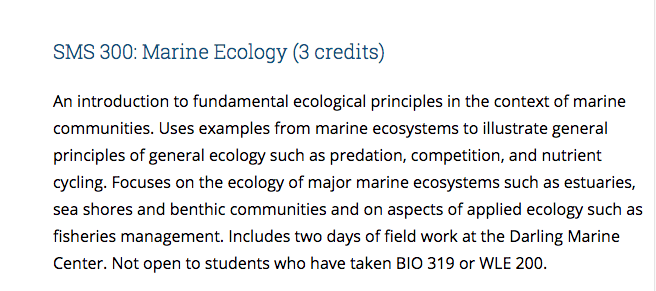
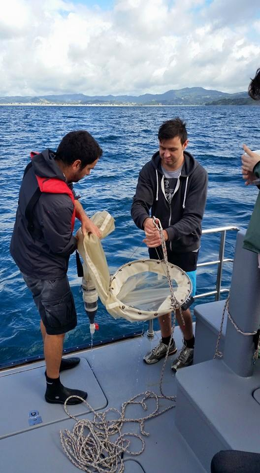
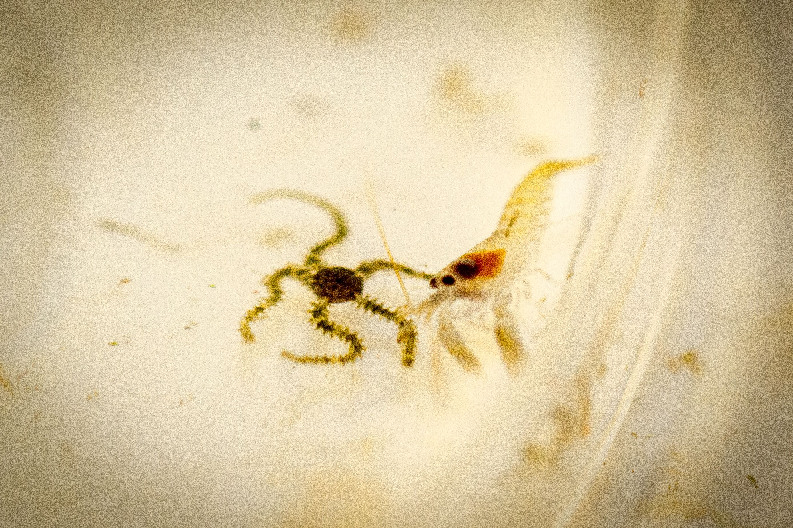
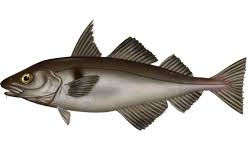
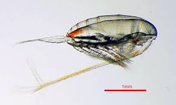
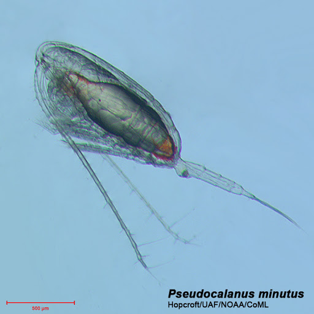
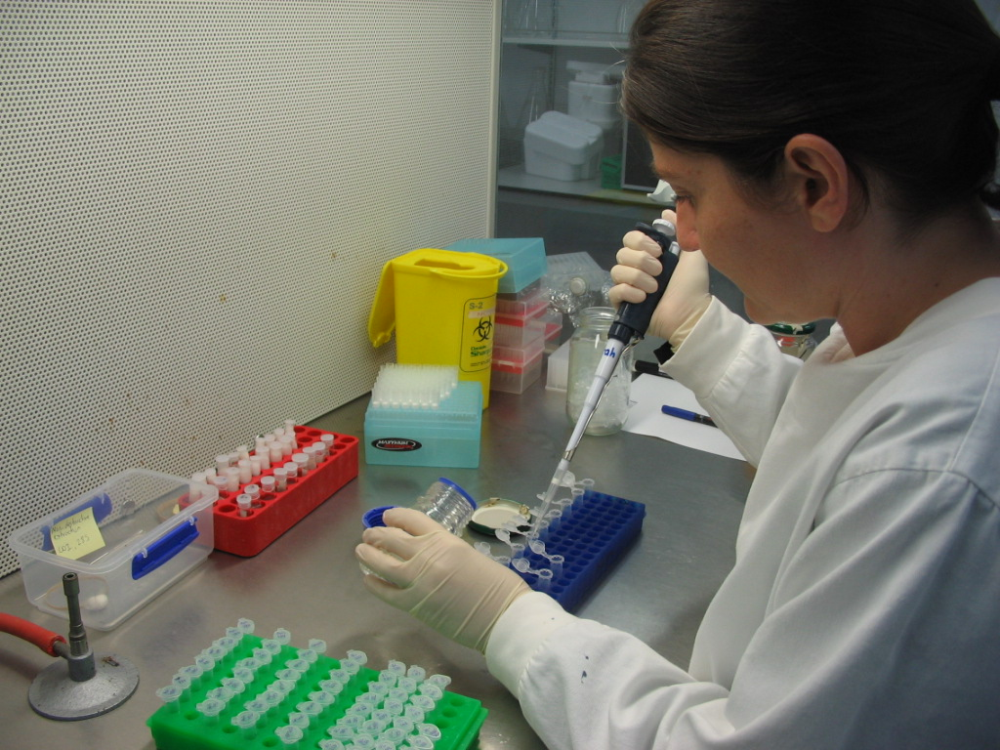
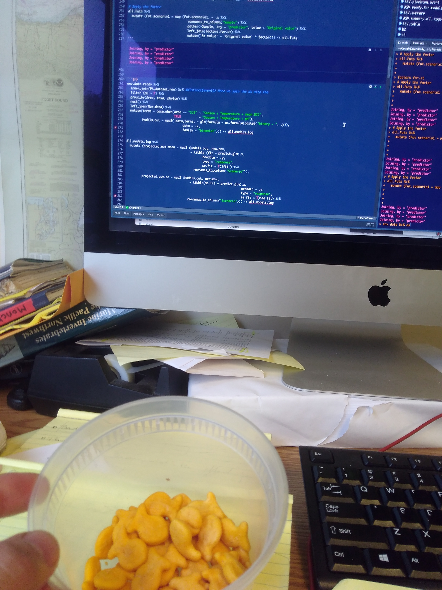

class:center,   inverse , middle

background-image: linear-gradient(150deg,rgba(0,0,0, 20%),rgba(0,0,0, 40%),rgba(0,0,0, 30%),rgba(0,0,0, 30%)),  url(images/bkg_plankton.png)
background-position: center
background-size: contain

```{r xaringan-themer, include=FALSE, warning=FALSE}
library(xaringanthemer)
style_duo_accent_inverse(primary_color = "#03A696", secondary_color = "#035AA6",
  header_font_google = google_font("Josefin Sans"),
  text_font_google   = google_font("Montserrat", "300", "300i"),
  code_font_google   = google_font("Fira Mono")
)
library(tidyverse)
library(leaflet)
library(here)
library (kableExtra)
```

```{css, echo=F}
.small { font-size: 70% }
.huge  { font-size: 120% }
```


# Zooplankton Ecology


 
### How marine wanderers shape  </br> major ecological processes 

.footnote.right[Ramón Gallego Simón, PhD]

```{r setup, include=FALSE}
options(htmltools.dir.version = FALSE)
```

???

Welcome everyone. Here I want to present a lecture/lectures for students of Marine Ecology. 

---

class:  nord-dark, typo-selection
name: TOC
background-image: linear-gradient(150deg,rgba(0,0,0, 80%),rgba(0,0,0, 90%),rgba(0,0,0, 30%),rgba(0,0,0, 10%)),  url(images/bkg_plankton.png)
background-position: center
background-size: contain
layout: true

---


# .center[A part of 

```{r, echo=F, out.extra='style=".center"'}

```

]
---

class: nord-dark, typo-selection
.pull-left[
# Outline

* Leverage on the concepts that this course is based on:
    * Competition
    * Predation
    * Adaptation

* Sees them in action in a group easily overlooked

* Combine field, laboratory, theory and bioinformatics
]

.pull-right[
# Learning goals:

* Diversity of zooplankton in:
    * Taxonomic
    * Size
    * Residence

* Importance of zooplankton as:

    * Phytoplankton grazers
    * Moving nutrients around
    * Keystone species for food webs
    * [Connectivity]() between populations

* Showcase diversity in this field 
]

---
.pull-left[
# Learning places


* Field work at Darling Marine Center

* Lectures

* Laboratory: 
    * Genetics **BIO 350**
    
    * Statistics for community ecology in **R**

]

.pull-right[
# Learning tools:

* Increase **engagement** through photos and other media

* Increase **participation** during classes with quiz-like questions

* Increase **learning** by using reverse-classroom setup on certain topics

* Increase student's connection with the topic by using examples from **local ecosystems**
]

---
layout: true
class: nord-light,  typo-selection
name: Darling 
background-image: linear-gradient(150deg, rgba(255, 255, 255, 100%), rgba(255, 255, 255, 80%), rgba(255, 255, 255, 20%)) ,url(images/Darling.jpg)
background-size: cover
---


.pull-left.black[
### Field work GOALS


* **Get hands-on experience in plankton sampling from a vessel.**:

  * Each student gets to use a plankton net
  
  * Each student gets to collect and tally environmental data]
  
  
.pull-right[


]  

---

.pull-left.black[
### Field work GOALS


* Get hands-on experience in plankton sampling from a vessel.

* **Gain knowledge of the plankton dynamics in the Gulf of Maine**:

    * Diversity
    
    * Composition changes
    
    * Environmental gradients]

.pull-right[
</br>
```{r, echo=F, message=F, warning=F}
leaflet(data = read_csv(here("data", "example.sites.csv")) ) %>% 
  addTiles() %>% 
  setView(lat = 43.925, lng = -69.58, zoom = 11.4) %>% 
  addMarkers(label = ~Site)
```

]  

---


.pull-left.black[
### Field work GOALS


* Get hands-on experience in plankton sampling from a vessel.
* Gain knowledge of the plankton dynamics in the Gulf of Maine
* **Students to merge morphological and molecular knowledge**
* **Collect eDNA samples**
]

.pull-right[
</br>
</br>



]  

---
layout: true
class: nord-dark,  typo-selection
name: Lectures 
background-image: linear-gradient(150deg, rgba(0,0,0, 100%), rgba(0,0,0, 80%), rgba(0,0,0, 20%)) ,url(images/bkg_plankton.png)
background-size: cover
---
name: Lect1
.pull-left[
### Lecture   GOALS

* ###**Diversity of Zooplankton**]

.pull-right[

### Lecture   TOOLS

* QUIZ-LIKE series of pics
</br>
* Slides showing diversity in:
</br>

    * Phyla

    * Sizes

    * Presence (holo- vs meroplankton)


] 

---
name: demo-slide1

## QUIZ TIME: PLANKTON EDITION

1. Do you know which of these is the largest zooplankton specimen ever found?
.pull-left[
# A. Pyrosome
<iframe width="560" height="315" src="https://www.youtube.com/embed/46GtJJorxIg?start=1&end=9" frameborder="0" allow="accelerometer; autoplay; encrypted-media; gyroscope; picture-in-picture" allowfullscreen></iframe>
]
.pull-right[
# B.  Siphonophore
<iframe width="560" height="315" src="https://www.youtube.com/embed/jnJE37twrzk?start=12&end=18" frameborder="0" allow="accelerometer; autoplay; encrypted-media; gyroscope; picture-in-picture" allowfullscreen></iframe>
]


---
name: demo-slide1

## QUIZ TIME: PLANKTON EDITION

2. Do you know which of these is the most abundant zooplankton?
.pull-left[
# A. Copepods
<iframe width="560" height="315" src="https://www.youtube.com/embed/kOdqwdegml4?start=9&end=15" frameborder="0" allow="accelerometer; autoplay; encrypted-media; gyroscope; picture-in-picture" allowfullscreen></iframe>
]

.pull-right[
# B. Krill
<iframe width="560" height="315" src="https://www.youtube.com/embed/oO-KRciHsTo?start=5&end=12" frameborder="0" allow="accelerometer; autoplay; encrypted-media; gyroscope; picture-in-picture" allowfullscreen></iframe>
]

---


name: Lect2

.pull-left[
### Lecture   GOALS

* **Diversity of Zooplankton**

* ###**Role of Zooplankton in transfering and distributing production**]

.pull-right[

### Lecture   topics


* phytoplankton productivity : 94% of all oceans primary production

* Zooplankton as grazers -> make that primary production available up the food chain

* Carcasses and fecal pellets as major drivers of bentho-pelagic coupling:
    * Benthic filter feeders
    * Bacterial mats -> decomposition

]

---

name: Lect3
.pull-left[
### Lecture   GOALS

* **Diversity of Zooplankton**
</br>

* **Role of Zooplankton in transfering and distributing production**
</br>
* ### **Ecological Processes** ]
.pull-right[

### Lecture TOPICS
* ##  **Predation** 
* ## **Adaptation**
* ## **Competition**
]

--

.center[
## The Gulf of Maine Copepod assemblages
]
---
name: GoM.copepod

# The Gulf of Maine Copepod assemblages

* ### Working example to showcase major ecological processes

* ### Major spp components show .huge.nord11[Adaptation] to different conditions

.st.noborder[
|  | **Cold water** | **Warm water** |
| ---- | ---- | ----: |
| **Small** | _Pseudocalanus_ spp. </br></br> _O.similis_  | _T. longicornis_ </br> _P. parvus_  </br> _Centropages_ spp.</br> _O. similis_ |
| **Large**  | _C. finmarchicus_</br></br> _M. lucens_|     |

]
---
name: GoM.copepod
class: center

# The Gulf of Maine Copepod assemblages

* ### Working example to showcase major ecological processes

* ### Major spp components show .huge.nord11[Adaptation] to different conditions

* ### .huge.nord11[Predation] upon copepods can shape community composition
.leftmost-column[

]
.center-column[

]
.rightmost-column[

]

---

layout: true
class: nord-light,  typo-selection
name: Laboratory 
background-image: linear-gradient(150deg, rgba(255, 255, 255, 100%), rgba(255, 255, 255, 80%), rgba(255, 255, 255, 20%)) ,url(images/Geneticslab_bigelow.png)
background-size: cover
---

.pull-left.black[
### Laboratory practical GOALS


## DNA extraction and PCR amplification


* **Present the project goals to .nord14[BIO 350]**

or

* **Get hands on experience**

  * Each group of three handles one eDNA sample

  * Each student gets to generate their own PCR replicate
  
  * Pooled samples and sequenced]
  
  
  
.pull-right[

</br>



]  

???

Regardless if they are using genetics in their career, knowledge of how to perform these tasks is paramount.Even from a management side

---
layout: true
class: nord-light,  typo-selection
name: Laboratory 
background-image: linear-gradient(150deg, rgba(255, 255, 255, 100%), rgba(255, 255, 255, 80%), rgba(255, 255, 255, 20%)) ,url(images/computer_labs.jpg)
background-size: cover
---

## Computer Laboratory GOALS

.pull-left[
### Handling their own community analysis

* **Get hands-on experience**:

  * All students get the same datasets:
      
      * Morphological ID abundances from the field work
      
      * eDNA dataset (Already demultiplexed, QC'd & ID'ed)
      
      * Environmental data

  * They get to use **R** to do their analysis and generate their reports
  
  * Analysis can be done in a web-browser using Rstudio.cloud]
  
  
.pull-right[


]  